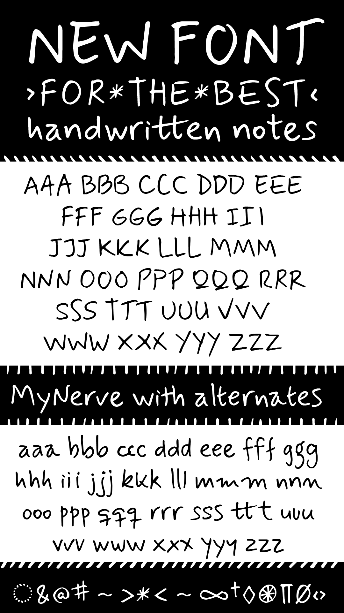

# MyNerve

[![][Fontbakery]](https://carolinashort.github.io/MyNerve/fontbakery/fontbakery-report.html)
[![][Universal]](https://carolinashort.github.io/MyNerve/fontbakery/fontbakery-report.html)
[![][GF Profile]](https://carolinashort.github.io/MyNerve/fontbakery/fontbakery-report.html)
[![][Outline Correctness]](https://carolinashort.github.io/MyNerve/fontbakery/fontbakery-report.html)
[![][Shaping]](https://carolinashort.github.io/MyNerve/fontbakery/fontbakery-report.html)

[Fontbakery]: https://img.shields.io/endpoint?url=https%3A%2F%2Fraw.githubusercontent.com%2Fcarolinashort%2FMyNerve%2Fgh-pages%2Fbadges%2Foverall.json
[GF Profile]: https://img.shields.io/endpoint?url=https%3A%2F%2Fraw.githubusercontent.com%2Fcarolinashort%2FMyNerve%2Fgh-pages%2Fbadges%2FGoogleFonts.json
[Outline Correctness]: https://img.shields.io/endpoint?url=https%3A%2F%2Fraw.githubusercontent.com%2Fcarolinashort%2FMyNerve%2Fgh-pages%2Fbadges%2FOutlineCorrectnessChecks.json
[Shaping]: https://img.shields.io/endpoint?url=https%3A%2F%2Fraw.githubusercontent.com%2Fcarolinashort%2FMyNerve%2Fgh-pages%2Fbadges%2FShapingChecks.json
[Universal]: https://img.shields.io/endpoint?url=https%3A%2F%2Fraw.githubusercontent.com%2Fcarolinashort%2FMyNerve%2Fgh-pages%2Fbadges%2FUniversal.json

MyNerve is a handwriting typeface designed to annotate and comment on documents with a fresh style. In addition, two sets of alternates allow variations when letters are repeated to emulate realistic script, together with some ligatures for frequent combinations. It can be used for informal texts, notes, or any project that would benefit from a casual script looking font. With a Latin Plus language coverage currently supports 219 Latin based languages.

## About

Carolina is a designer from Buenos Aires; after 30 years of working as a professional designer in the industry, and part-time teaching experience in Argentina, Germany, and New Zealand, took a full-time academic position at the University of Waikato <https://profiles.waikato.ac.nz/carolina.short/about>.

## Building

Fonts are built automatically by GitHub Actions - take a look in the "Actions" tab for the latest build.

If you want to build fonts manually on your own computer:

* `make build` will produce font files.
* `make test` will run [FontBakery](https://github.com/googlefonts/fontbakery)'s quality assurance tests.
* `make proof` will generate HTML proof files.

The proof files and QA tests are also available automatically via GitHub Actions - look at https://carolinashort.github.io/MyNerve.

## Changelog

When you update your font (new version or new release), please report all notable changes here, with a date.
[Font Versioning](https://github.com/googlefonts/gf-docs/tree/main/Spec#font-versioning) is based on semver. 
Changelog example:

**26 May 2021. Version 2.13**
- MAJOR Font turned to a variable font.
- SIGNIFICANT New Stylistic sets added.

## License

This Font Software is licensed under the SIL Open Font License, Version 1.1.
This license is available with a FAQ at
https://scripts.sil.org/OFL

## Repository Layout

This font repository structure is inspired by [Unified Font Repository v0.3](https://github.com/unified-font-repository/Unified-Font-Repository), modified for the Google Fonts workflow.
